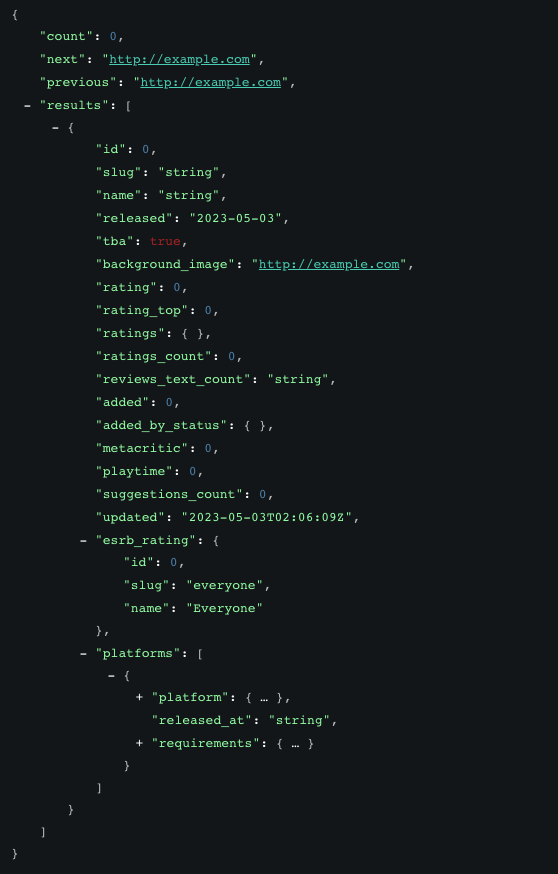
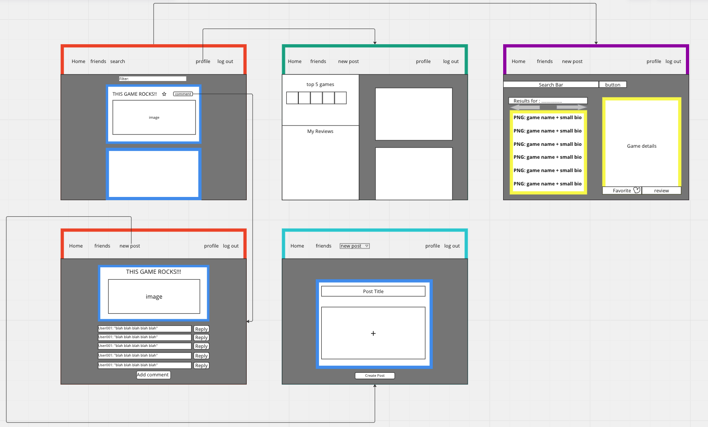

# App Title

## Summary 
* Discover a social media app tailored for passionate video game enthusiasts! Immerse yourself in a vibrant gaming community where you can manage your favorite games, express your opinions through comments, reviews, and ratings. Keep a finger on the pulse of the gaming world, staying updated on conversations that fuel your interests. Unleash your inner gamer and experience the world of gaming like never before with this fun and interactive social media app!

## API 

RAWG API - https://api.rawg.io/docs/
limits at 20,000 calls per month

---
## RESTful Routing Chart

---
## ERD

---
## Wireframe

## User Stories 
* As a user, I want to create an account and log in so that I have a personalized experience.
* As a gamer, I want to make posts expressing my thoughts about my favorite (or least favorite!) games.
* As a poster, I want to search a comprehensive database of games so that I can select the one that I want to make a post or review about.
* As a poster, I want to make posts that don't have to be tied to one specific game so that I can express myself in a more open-ended/freeform way.
* As a reader, I want to browse posts by users so that I can enjoy seeing other people's thoughts about various games.
* As a reader, I want to make comments on the posts I read so that I can be a participant in the discussions.
* As a poster, I want to see a list of my own posts on my profile so that I can easily view all of my previous posts.
* As a user, I want to view other users' profiles so that I can easily view all of *their* previous posts.
## MVP

## Stretches

## Potential Roadblocks