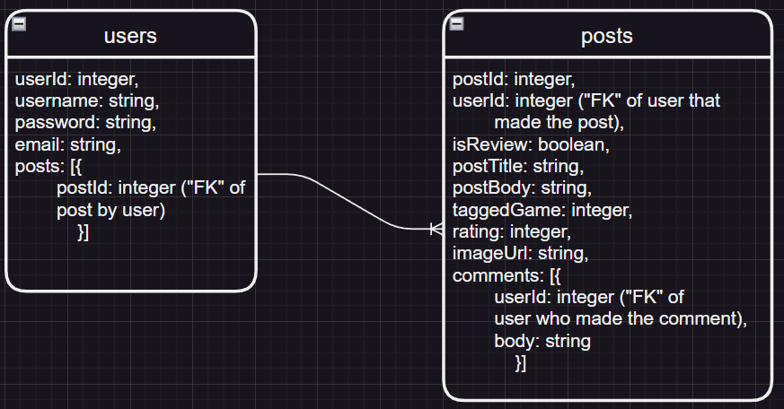

# App Title

## Summary 
* Discover a social media app tailored for passionate video game enthusiasts! Immerse yourself in a vibrant gaming community where you can manage your favorite games, express your opinions through comments, reviews, and ratings. Keep a finger on the pulse of the gaming world, staying updated on conversations that fuel your interests. Unleash your inner gamer and experience the world of gaming like never before with this fun and interactive social media app!

Backend repo located [here](https://github.com/jaronw1/project3server).

## API 

RAWG API - https://api.rawg.io/docs/
limits at 20,000 calls per month

---
## RESTful Routing Chart

| VERB   | URL                | CRUD    | DESCRIPTION                                                           | VIEW                                                                      |
|:------ |:------------------ |:------- |:--------------------------------------------------------------------- |:------------------------------------------------------------------------- |
| GET    | /users/auth-locked | Read    | Checks if user is authed                                              | Directs to auth-only **lounge**                                           |
| POST   | /users/register    | Create  | Create new user in DB                                                 | Directs to profile                                                        |
| POST   | /users/login       | Read    | Log in user                                                           | Directs to profile                                                        |
| GET    | /users/:id         | Read    |                                                                       | Directs to a user profile page for user :id that shows posts by that user |
| PUT    | /users            | Update  | Update information about a specific user (restrict to logged-in user) |                                                                           |
| DELETE | /users            | Destroy | Delete a user                                                         |                                                                           |
| GET    | /posts             | Read    | Fetches X number of posts starting from newest                        | Shows newest posts                                                        |
| POST   | /posts             | Create  | Create new post in DB                                                 | Directs to page for new post                                              |
| GET    | /posts/:id         | Read    | Fetches a post from the DB                                            |                                                                           |
| PUT    | /posts            | Update  | Update a specific post                                                |                                                                           |
| DELETE | /posts             | Destroy | Delete a post                                                         |                                                                           |
| GET    | /games             | n/a     | Asks server to query the RAWG API for a list of games                 | Populates search page with results                                        |                                       |

---
## ERD

---
## Wireframe

## User Stories 
* As a user, I want to create an account and log in so that I have a personalized experience.
* As a user, I want to make posts expressing my thoughts about my favorite (or least favorite!) games.
* As a user, I want to search a comprehensive database of games so that I can select the one that I want to make a post or review about.
* As a user, I want to make posts that don't have to be tied to one specific game so that I can express myself in a more open-ended/freeform way.
* As a user, I want to browse posts by users so that I can enjoy seeing other people's thoughts about various games.
* As a user, I want to make comments on the posts I read so that I can be a participant in the discussions.
* As a user, I want to see a list of my own posts on my profile so that I can easily view all of my previous posts.
* As a user, I want to view other users' profiles so that I can easily view all of *their* previous posts.

## MVP

* Users can sign in and sign out
* Users can make posts
* Users can perform a search to get results from RAWG's API and see details, then select a game to make a post related to that game
* Posts can be reviews, game posts, or game-agnostic
* Users can leave comments on posts
* Users have a profile page
* Home page shows all posts sorted by newest

## Stretches

* Preferences page / allow user to modify settings, change PW, change profile pic
* Edit posts
* Filter/sort posts on home page
* Add games to a list of favorites

## Potential Roadblocks

* Using Cors for the first time might give us bugs.
* State managment might take a little bit more than we predict.
* Conditionally rendering on the same component can be difficult.
* Having a dynamic display that is also user intuitive.
* The pure volume components can be hard to manage and navigate.